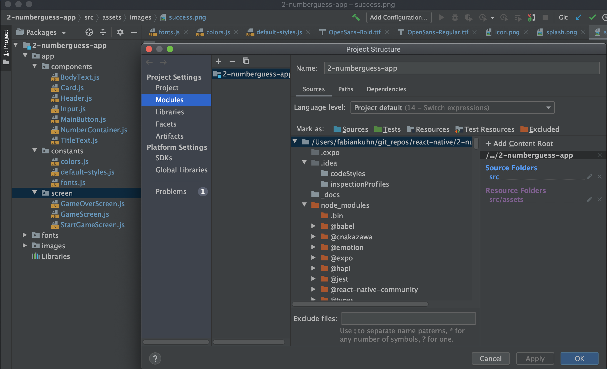

# NumberGuessing-App
Simple game, where a number is selected. The computer than guesses numbers within a range and tips can be given (higher or lower number).

## Concepts
- [Folder Structure](#folder-structure)
- [Adding Fonts](#adding-fonts)
- [Adding Images](#adding-images)
- [Adding Icons](#adding-icons)
- [React Hooks](#react-hooks)
- [Styling Scopes](#styling-scopes)
- [Lists](#lists)

## Folder Structure
```
├── app
│   ├── components
│   │   ├── BodyText.js
│   │   ├── Card.js
│   │   ├── Header.js
│   │   ├── Input.js
│   │   ├── MainButton.js
│   │   ├── NumberContainer.js
│   │   └── TitleText.js
│   ├── constants
│   │   ├── colors.js
│   │   ├── default-styles.js
│   │   └── fonts.js
│   └── screen
│       ├── GameOverScreen.js
│       ├── GameScreen.js
│       └── StartGameScreen.js
└── assets
    ├── fonts
    │   ├── OpenSans-Bold.ttf
    │   └── OpenSans-Regular.ttf
    └── images
        ├── icon.png
        ├── splash.png
        └── success.png
```
Set SRC as Source Folder and assets as Resources


## Adding Fonts
Outside of the App Class
```jsx
const fetchFonts = () => {
  return Font.loadAsync({
    'open-sans': require('./src/assets/fonts/OpenSans-Regular.ttf'),
    'open-sans-bold': require('./src/assets/fonts/OpenSans-Bold.ttf'),
  });
};
```

Inside the App Class
```jsx
// State to store the boolean loaded
const [dataLoaded, setDataLoaded] = useState(false);

// Check for Loaded fonts
if(!dataLoaded){
  return <AppLoading
    startAsync={fetchFonts}
    onFinish={() => setDataLoaded(true)}
    onError={error => console.log(error)}
  />;
}
```

## Adding Images
```jsx
<Image
  fadeDuration={4000} // Fade for source images (web url)
  // Link by File
  source={require('./../../assets/success.png')}
  // source={{uri: 'https://cdn.pixabay.com/photo/2016/05/05/23/52/mountain-summit-1375015_960_720.jpg'}}
  resizeMode="cover" // options for stretch
/>
```

## Adding Icons
Search for Icons here: [https://icons.expo.fyi/](https://icons.expo.fyi/)
```jsx
<Ionicons name="md-remove" size={24} color="white" />
```

    
## React Hooks
useState: Destructured const for value and setter. The UI gets re-rendered when the state changes.
```jsx
const [currentGuess, setCurrentGuess] = useState(
  generateRandomBetween(1, 99, props.userChoice)
);
``` 
useRef: The useRef contains a current value, that stays present for the lifecycle of the component. The UI does not get re-rendered. 
```jsx
const currentHigh = useRef(100);
currentHigh.current = currentGuess;
```

useEffect: The useEffect listens for state changes. In this case in `[currentGuess, userChoice, onGameOver]`. If the state changes the specified function gets executed.
```jsx
useEffect(() => {
    if(currentGuess === props.userChoice){
        props.onGameOver(rounds)
    }
}, [currentGuess, userChoice, onGameOver]);
```
    
## Styling Scopes
Method 1: Component
- Preferred Way to reuise Styling
- `props.children` contains the Input of Parent
- `{...props.style, ...styles.bodyText}` uses destructuring to bind scoped styling with inherited styling of parent.


```jsx
import React from 'react';
import { View, Text, StyleSheet } from 'react-native';

const BodyText = props => {
  return (
    <View>
      <Text style={{...props.style, ...styles.bodyText}}>{props.children}</Text>
    </View>
  )
};

const styles = StyleSheet.create({
  bodyText: {
    fontFamily: 'open-sans'
  }
});

export default BodyText;
```

Method 2: fonts.js
```jsx
export const Fonts  = {
  bodyText: 'open-sans',
  titleText: 'open-sans-bold'
};
```

Method 3: default-styles.js
```jsx
import {StyleSheet} from "react-native";

export default StyleSheet.create({
  bodyText: {
    fontFamily: 'open-sans'
  },
  bodyTitle: {
    fontFamily: 'open-sans-bold'
  }
});
```

Import in header.js
```jsx
const styles = StyleSheet.create({
    headerTitle: {
        fontFamily: Fonts.titleText, // Method 2
        ...DefaultStyles.bodyTitle // Method 3
    }
});
```

## Lists

#### ScrollView
The Scrollview should hold a limited amount of items. For example 100 text items. If the List contains heavy images etc. consider FlatList.
```jsx
<View style={styles.listContainer}>
  <ScrollView contentContainerStyle={styles.list}>
      {pastGuesses.map((guess, index) => (        
        <View key={value} style={styles.listItem}>
            <BodyText>#{pastGuesses.length - index}:</BodyText>
            <BodyText>{guess}</BodyText>
        </View>
      ))}
  </ScrollView>
</View>
```

Styling of ScrollView
```jsx 
const styles = StyleSheet.create({
    listContainer: {
        flex: 1, // Needed for Android
        width: '80%',
        marginVertical: 20
    },
    list: {
        flexGrow: 1, // Needed for Bottom Up View
        alignItems: 'center',
        justifyContent: 'flex-end'
    },
    listItem: {
        borderColor: '#ccc',
        margin: 10,
        padding: 15,
        backgroundColor: 'white',
        borderWidth: 1,
        borderRadius: 5,
        flexDirection: 'row',
        justifyContent: 'space-around',
        width: '60%'
    }
});
```

#### Flatlist
Render a Flatlist. Set Styles with `contentContainerStyle`. The first argument in the.bind is this, then the arguments passed. The last received item in FlatList is the item, which contains an index and the value.
```jsx
<FlatList
    data={pastGuesses}
    renderItem={renderListItem.bind(this, pastGuesses.length)}
    keyExtractor={(item => item)}
    contentContainerStyle={styles.list}>
</FlatList>;

const renderListItem = (listLength, itemData) => (
    <View style={styles.listItem}>
        <BodyText>#{listLength - itemData.index}:</BodyText>
        <BodyText>{itemData.item}</BodyText>
    </View>
);
```

Styling of FlatList
```jsx
const styles = StyleSheet.create({
    listContainer: {
        flex: 1, // Needed for Android
        width: '60%',
        marginVertical: 20
    },
    list: {
        flexGrow: 1, // Needed for Bottom Up View
        justifyContent: 'flex-end'
    },
    listItem: {
        borderColor: '#ccc',
        marginVertical: 10,
        padding: 15,
        backgroundColor: 'white',
        borderWidth: 1,
        borderRadius: 5,
        flexDirection: 'row',
        justifyContent: 'space-around',
        width: '100%'
    }
});
```
